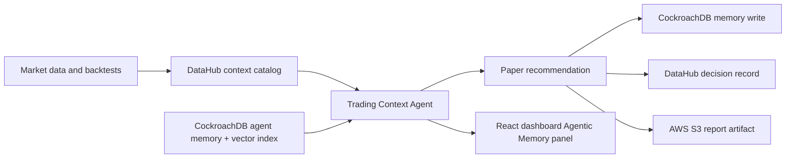

# OLINCK BOT AI

OlinckBotAI is a professional paper-first algorithmic trading platform with FastAPI, React TypeScript, PostgreSQL, Redis, exchange market data, strategy research, backtests, risk controls, AI reports, notifications, and a modern dashboard.

Real trading is disabled by default. The system starts in paper mode and refuses real orders unless `REAL_TRADING_ENABLED=true` is explicitly configured.

## Problem Solved

Trading agents often make recommendations without a trustworthy data context or a persistent memory of what worked, what failed, and why. OlinckBotAI now adds two complementary agent layers:

- **DataHub AI Context**: the agent retrieves governed context before making a recommendation.
- **Agentic Memory with CockroachDB**: each decision, rationale, indicators, risk level, and outcome can be stored and semantically retrieved later.

This makes the agent explainable, auditable, and safer for paper-trading strategy iteration.

## Architecture



Core runtime:

- **Backend**: FastAPI
- **Frontend**: React + TypeScript
- **Operational database**: PostgreSQL for local default trading state
- **Cache**: Redis
- **Agent memory**: CockroachDB Cloud when configured, local JSON demo fallback otherwise
- **Data catalog/context**: DataHub GMS GraphQL when configured, local demo context otherwise
- **Cloud deployment target**: AWS ECS Fargate for the FastAPI container and Amazon S3 for agent-context report artifacts

## DataHub Usage

`backend/app/services/datahub_context.py` implements a DataHub adapter:

- Retrieves assets, market sources, indicators, strategies, backtests, risk metrics, and previous decisions.
- Uses DataHub GMS GraphQL in production.
- Supports a `DATAHUB_MCP_SERVER_URL` variable for a hackathon MCP deployment path.
- Includes the official DataHub Skills installed under `.agents/skills/` for setup, search, enrichment, lineage, quality, and connector planning workflows.
- Falls back to local demo context when DataHub credentials are unavailable.
- Records the latest decision metadata back to DataHub when connected.

## DataHub Hackathon Review

For the Build with DataHub hackathon, use the following review materials:

- Copy-ready Devpost text: `docs/DATAHUB_DEVPOST.md`
- Two-minute-thirty video script: `docs/DATAHUB_VIDEO_SCRIPT.md`
- Representative agent output: `examples/datahub_agent_context_response.json`

The hackathon addition is the governed context workflow: the agent reads DataHub context before every recommendation and records decision metadata afterward. See `docs/DATAHUB_DEVPOST.md` for the pre-existing work disclosure.

## CockroachDB Usage

`backend/app/services/agent_memory.py` implements `AgentMemoryService`.

Stored memory fields:

- asset symbol
- market context
- indicators used
- strategy considered
- risk level
- final decision: buy, sell, wait, or refuse
- reasoning
- timestamp
- later outcome
- embedding vector

CockroachDB capabilities used:

- **Distributed Vector Indexing**: `VECTOR(16)` column plus `CREATE VECTOR INDEX` for semantic recall.
- **ccloud CLI**: `scripts/cockroach_agent_memory_setup.ps1` prepares the cloud database and applies the schema.

## AWS Usage

The simplest reliable AWS architecture is:

- **Amazon ECS Fargate** runs the FastAPI backend container.
- **Amazon S3** stores JSON agent-context reports after each recommendation.
- Secrets are referenced through AWS Systems Manager Parameter Store in `infra/aws/ecs-task-definition.example.json`.

`backend/app/services/aws_reports.py` uses S3 when `AWS_S3_REPORTS_BUCKET` is configured. Without AWS credentials, it writes local demo artifacts.

## Local Demo Mode

The project works without CockroachDB, DataHub, or AWS credentials:

- `DATAHUB_DEMO_MODE=true`
- `COCKROACH_DEMO_MODE=true`
- `AWS_S3_REPORTS_BUCKET=` empty

The dashboard still shows:

- DataHub AI Context
- similar agent memories
- recommendation and rationale
- confirmation that the decision was memorized
- local report artifact path

## Start Locally

```powershell
Copy-Item .env.example .env
docker compose up --build
```

Open:

- Frontend: http://localhost:5173
- API health: http://localhost:8000/api/health
- API docs: http://localhost:8000/docs
- Agent context: http://localhost:8000/api/agent-context?symbol=BTCUSDT

## Validate

```powershell
.\scripts\validate.ps1
```

Or run focused checks:

```powershell
cd backend
pytest tests/test_agent_memory.py tests/test_datahub_context.py
cd ..\frontend
npm run build
```

## Environment Variables

Use `.env.example` as the full template. Never commit `.env`.

Required for local demo:

- `DATABASE_URL`
- `REDIS_URL`
- `TRADING_MODE=paper`
- `REAL_TRADING_ENABLED=false`

DataHub production:

- `DATAHUB_ENABLED=true`
- `DATAHUB_DEMO_MODE=false`
- `DATAHUB_GMS_URL`
- `DATAHUB_TOKEN`
- `DATAHUB_PLATFORM`
- `DATAHUB_MCP_SERVER_URL` if using the MCP path

CockroachDB production:

- `COCKROACH_ENABLED=true`
- `COCKROACH_DEMO_MODE=false`
- `COCKROACH_DATABASE_URL`
- `COCKROACH_VECTOR_DIMENSIONS=16`
- `COCKROACH_MCP_SERVER_URL` if using the managed MCP server

When running Docker with `sslmode=verify-full`, the CockroachDB CA certificate must exist on the host at:

```text
%USERPROFILE%\.postgresql\root.crt
```

`docker-compose.yml` mounts that certificate read-only into the backend container at `/root/.postgresql/root.crt`.

AWS production:

- `AWS_REGION`
- `AWS_S3_REPORTS_BUCKET`
- `AWS_ECS_CLUSTER`
- `AWS_ECS_SERVICE`

Prepare the S3 report store with:

```powershell
.\scripts\aws_prepare_s3_reports.ps1 -Region eu-west-1 -BucketName olinckbotai-agent-reports-<unique-suffix>
```

This deploys `infra/aws/s3-agent-reports.cloudformation.yml`, creating an encrypted private S3 bucket with 30-day demo artifact retention and an IAM writer policy for ECS or Lambda.

Exchange keys and notification tokens must remain empty for public demos.

## Demo Scenario Under 3 Minutes

1. Open the dashboard and show the `Agentic Memory` panel in local demo mode.
2. Open `/api/agent-context?symbol=BTCUSDT` and show the DataHub context used.
3. Explain that the agent retrieves similar CockroachDB memories before deciding.
4. Refresh once: a new decision is saved and a memory id appears.
5. Show that real trading remains disabled and all recommendations are paper-only.

## Security

- No API keys, AWS secrets, CockroachDB credentials, DataHub tokens, exchange keys, `.env` files, or personal data are committed.
- Real trading is blocked by default.
- Withdrawal features are not implemented.
- Agent recommendations are explainable and stored for audit.
- AWS task definitions reference secrets by parameter names, not secret values.

## Documentation

- `docs/ARCHITECTURE.md`
- `docs/CONFIGURATION.md`
- `docs/OPERATIONS.md`
- `docs/EXTENDING.md`
- `docs/DATAHUB_SUBMISSION.md`
- `docs/COCKROACH_AWS_SUBMISSION.md`
- `docs/HACKATHON_DEMO_SCRIPT.md`
- `docs/HACKATHON_SUBMISSION_STATUS.md`
- `docs/DEVPOST_ANSWERS.md`
