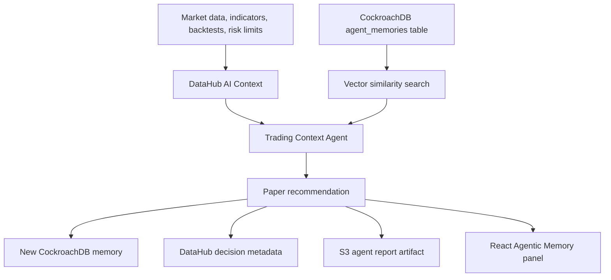

# OlinckBotAI - CockroachDB x AWS: Build with Agentic Memory

## Project Overview

OlinckBotAI is a paper-first algorithmic trading platform that now includes governed agent context and persistent agentic memory. Before recommending a trading strategy, the Trading Context Agent retrieves metadata from DataHub and similar past decisions from CockroachDB, then saves the new decision and its rationale for future learning.

## Problem

Trading agents can be dangerous when they act without memory. A strategy may look attractive in isolation while past decisions show repeated losses, elevated drawdown, weak validation, or risk-limit conflicts. OlinckBotAI solves this by making every recommendation context-aware, memory-aware, and auditable.

## Agentic Memory Architecture



The agent records:

- asset symbol
- market context
- indicators used
- strategy considered
- risk level
- final decision: buy, sell, wait, or refuse
- reasoning
- timestamp
- later outcome when available
- embedding vector for semantic recall

## CockroachDB Tools Used

1. **Distributed Vector Indexing**

The schema stores deterministic embeddings in a `VECTOR(16)` column and creates a vector index:

```sql
CREATE VECTOR INDEX IF NOT EXISTS agent_memories_embedding_idx ON agent_memories (embedding);
```

The service then searches similar memories before each new recommendation:

```sql
SELECT *, (embedding <-> $1::VECTOR) AS distance
FROM agent_memories
ORDER BY embedding <-> $1::VECTOR
LIMIT $2;
```

2. **ccloud CLI**

`scripts/cockroach_agent_memory_setup.ps1` uses `ccloud` to verify authentication, create the database, and apply the memory schema.

Verified cloud setup:

- CockroachDB Cloud cluster created: `olinck-agent-memory`
- Database created: `olinck_agent_memory`
- Table created: `agent_memories`
- Vector index created: `agent_memories_embedding_idx`
- Backend smoke test wrote and retrieved memories using the live cluster.

Optional third integration path:

- `COCKROACH_MCP_SERVER_URL` is included for CockroachDB Cloud Managed MCP Server demos.

## DataHub Context For The Second Hackathon

The same build also supports the DataHub hackathon. `DataHubClient` retrieves assets, sources, indicators, strategies, backtests, risk metrics, and previous decisions from DataHub GMS GraphQL when configured. Demo mode provides local governed context without secrets.

The dashboard panel shows:

- data consulted
- agent recommendation
- decision rationale
- DataHub record confirmation
- CockroachDB memory confirmation

## AWS Services Used

1. **Amazon ECS Fargate**

The FastAPI backend is prepared to run as a containerized service. `infra/aws/ecs-task-definition.example.json` defines the Fargate task shape and references secrets from AWS Systems Manager Parameter Store.

2. **Amazon S3**

`AWSReportStore` writes each agent-context report to S3 when `AWS_S3_REPORTS_BUCKET` is configured. In demo mode it writes a local JSON artifact.

`infra/aws/s3-agent-reports.cloudformation.yml` creates the encrypted private report bucket and a least-privilege writer policy. `scripts/aws_prepare_s3_reports.ps1` deploys it with the AWS CLI. The S3 path has been deployed and smoke-tested with a real agent-context report artifact.

## Security and Privacy

- Real trading is disabled by default.
- No withdrawals are implemented.
- No `.env`, exchange keys, AWS secrets, DataHub tokens, CockroachDB passwords, or personal data are committed.
- AWS task definitions reference secret names, not values.
- DataHub and CockroachDB integrations have local demo fallbacks.
- Agent decisions cite historical context and remain paper-only unless a human explicitly enables real trading in production.

## Setup Instructions

Local demo:

```powershell
Copy-Item .env.example .env
docker compose up --build
```

CockroachDB Cloud:

```powershell
$env:COCKROACH_CLUSTER_NAME="your-cluster-name"
.\scripts\cockroach_agent_memory_setup.ps1
```

Then set:

```text
COCKROACH_ENABLED=true
COCKROACH_DEMO_MODE=false
COCKROACH_DATABASE_URL=postgresql://<user>:<password>@<host>:26257/olinck_agent_memory?sslmode=verify-full
```

AWS:

```powershell
.\scripts\aws_prepare_s3_reports.ps1 -Region eu-west-1 -BucketName olinckbotai-agent-reports-<unique-suffix>
```

```text
AWS_REGION=eu-west-1
AWS_S3_REPORTS_BUCKET=<your-report-bucket>
AWS_ECS_CLUSTER=<your-ecs-cluster>
AWS_ECS_SERVICE=<your-ecs-service>
```

DataHub:

```text
DATAHUB_ENABLED=true
DATAHUB_DEMO_MODE=false
DATAHUB_GMS_URL=https://<your-datahub-gms>
DATAHUB_TOKEN=<stored-only-in-env-or-secret-manager>
```

## Why This Is Production-Ready

- The new agent memory is isolated from the trading execution engine.
- Paper mode remains the default and real trading remains locked.
- The memory schema is auditable and stores rationale, inputs, outcomes, and timestamps.
- Vector recall gives the agent historical context before it recommends action.
- DataHub adds governed context and explainability.
- AWS ECS and S3 provide a clear deployment path with secret-manager-friendly configuration.
- Tests cover memory writing, retrieval, semantic search, DataHub demo context, and memory-enriched decisions.

## Video Demo Under 3 Minutes

Video link is intentionally pending until the final hackathon-specific recording is ready. Do not reuse the older general OlinckBotAI video unless the deadline requires a placeholder.

1. Show OlinckBotAI dashboard and the `Agentic Memory` panel.
2. Trigger or refresh `BTCUSDT` agent context and show the first analysis being saved.
3. Show a similar market situation: the agent retrieves previous CockroachDB memories and cites them.
4. Explain the recommendation and risk level shown in the panel.
5. Show confirmation that the new decision was saved, DataHub was updated, and real trading remains disabled.
