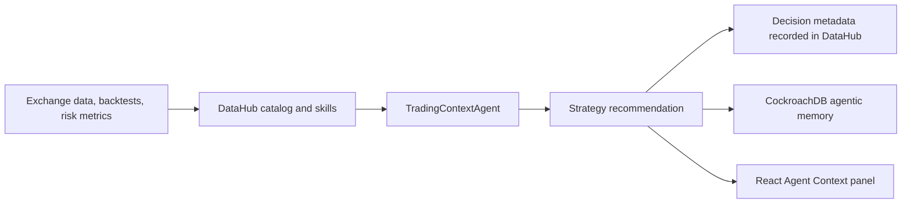

# OlinckBotAI - Build with DataHub Submission

## Project Overview

OlinckBotAI is a paper-first algorithmic trading platform that combines market data, risk controls, backtests, strategy research, and an explainable trading agent. For the DataHub hackathon, the project adds a governed context layer so the agent does not recommend a strategy from isolated price signals alone.

## Problem

Trading agents can become unsafe when they ignore data lineage, stale sources, risk definitions, or previous decisions. OlinckBotAI solves this by forcing the `TradingContextAgent` to retrieve trusted trading context before producing a recommendation, then record the recommendation afterward for auditability.

## DataHub Architecture



## DataHub Capabilities Used

- **Live DataHub OSS deployment**: the governed catalog is available at `https://datahub.chapimo.com`.
- **DataHub GraphQL API**: the Firebase Functions endpoint searches the catalog for OlinckBotAI datasets before building its response.
- **DataHub REST ingest proposal**: each agent-context request updates the `agent_decisions` dataset with auditable decision metadata.
- **DataHub MCP/Skills path**: official DataHub Skills are installed under `.agents/skills/` for catalog search, enrichment, lineage, quality, setup, and connector planning workflows.
- **Secret-managed access**: the production token is held in Firebase Secret Manager and is never exposed to the browser or repository.

## Agent Flow

1. The dashboard or `/api/agent-context` asks for a recommendation.
2. The API retrieves governed OlinckBotAI catalog assets from DataHub GraphQL.
3. The agent retrieves similar historical decisions from CockroachDB memory.
4. It explains which context and memories were used.
5. It records the new decision metadata in the governed DataHub `agent_decisions` dataset.

## Local Demo

```powershell
Copy-Item .env.example .env
docker compose up --build
```

Open:

- `http://localhost:5173`
- `http://localhost:8000/api/agent-context?symbol=BTCUSDT`

Keep these variables for demo mode:

```env
DATAHUB_DEMO_MODE=true
COCKROACH_DEMO_MODE=true
AWS_S3_REPORTS_BUCKET=
REAL_TRADING_ENABLED=false
```

## Production DataHub Setup

The production review environment is already live:

- DataHub: `https://datahub.chapimo.com`
- Agent API: `https://olinckbotai.web.app/api/agent-context?symbol=BTCUSDT`
- Expected proof: `context_used.datahub.mode` is `datahub` and `datahub_record.saved` is `true`.

Set:

```env
DATAHUB_ENABLED=true
DATAHUB_DEMO_MODE=false
DATAHUB_GMS_URL=https://your-datahub-instance/gms
DATAHUB_TOKEN=your-datahub-personal-access-token
DATAHUB_PLATFORM=olinckbotai
DATAHUB_MCP_SERVER_URL=https://your-datahub-mcp-server
```

Never commit these values. Store them in `.env` locally or a cloud secret manager for deployment.

## Video Scenario Under 3 Minutes

1. Show the dashboard and the `Agentic Memory` panel.
2. Trigger `https://olinckbotai.web.app/api/agent-context?symbol=BTCUSDT`.
3. Point out the live DataHub asset and the successful DataHub decision-record confirmation.
4. Show the recommendation, reasoning, and paper-only trading status.
5. Refresh and show that the decision was recorded for future context.

## Why It Is Production-Ready

- Real trading is disabled by default.
- DataHub credentials are environment-only.
- The agent cites context before recommending.
- Every decision is auditable.
- The same UI works in local demo mode and connected cloud mode.
